 


# Lab Info

| Name    | Os    | Difficulty |
| ------- | ----- | ---------- |
| Gitroot | Linux | Advance    |
-  View the investigation board in the [Gitroot Canvas](/write-ups/gitroot/#canvas)

---
# Recon
## Nmap
```bash
nmap -p22,80,11211 --min-rate=1000 192.168.175.75 -sCV
```

```bash
PORT      STATE SERVICE   VERSION
22/tcp    open  ssh       OpenSSH 7.9p1 Debian 10+deb10u2 (protocol 2.0)
| ssh-hostkey: 
|   2048 bf:45:f6:b3:e3:ce:0c:69:18:5a:5b:27:e5:d3:9c:86 (RSA)
|   256 b5:d7:45:50:06:c4:e2:3c:28:52:b8:06:26:1f:de:b0 (ECDSA)
|_  256 27:f0:d0:21:13:30:9c:5e:f0:70:a1:d8:5c:a7:8f:75 (ED25519)
80/tcp    open  http      Apache httpd 2.4.38 ((Debian))
|_http-title: 400 Bad Request
|_http-server-header: Apache/2.4.38 (Debian)
11211/tcp open  memcache?
| fingerprint-strings: 
|   RPCCheck: 
|_    Unknown command
```
- found 3 open ports
1. `22` -> ssh
2. `80` : -> Apache httpd
3.  `11211` -> memcache (cache system for webserver, database)
	- tried some   [memcache enumeration](https://hackviser.com/tactics/pentesting/services/memcached) guess what i got <span class="spoiler"></span>

---
# Web (80)

### gitroot.vuln


-   it reveal 3 things
	- possible username : `jen`
	- vhost : `wp.gitroot.vuln`
	- wordpress in use on `wp.gitroot.vuln`


- add vhost to `/etc/hosts` 

I tried fuzzing for files &  directory and got nothing.
### wp.gitroot.vuln

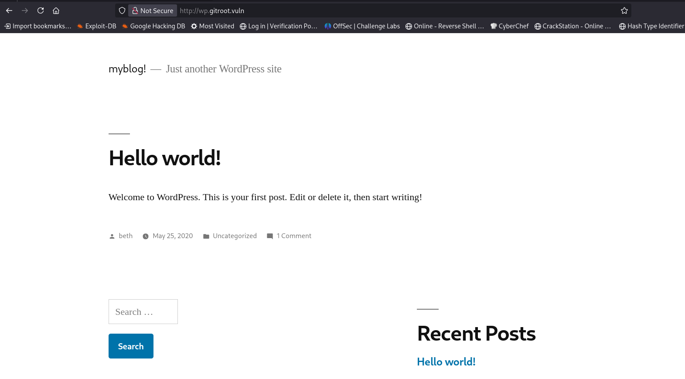


- posted by `beth` (possible username)

**login page**

tried `wpscan` to find usernames, vulnerable plugins, but got nothing.

Then i tried the name we found : `jen`, `beth`

username beth is valid but can't find valid password 


## vhost fuzzing
- used a GOAT  🗿 wordlist
```bash
ffuf -u "http://gitroot.vuln/" -w /usr/share/seclists/Discovery/DNS/subdomains-top1million-20000.txt -H "Host: FUZZ.gitroot.vuln" -fs 191
```

```bash
wp                      [Status: 200, Size: 10697, Words: 465, Lines: 132, Duration: 
repo                    [Status: 200, Size: 438, Words: 46, Lines: 22, Duration:
```

- found a new vhost `repo.gitroot.vuln` 

- add new vhost to `/etc/hosts`
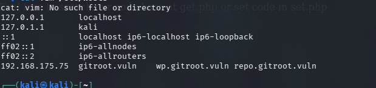

## repo.gitroot.vuln

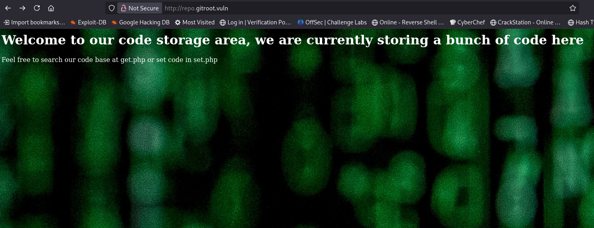

- revel 2 files
	- `get.php` : has parameter `store` to retrive from server
	- `set.php` : has parameter `key=fuck&value=carzy`

I tried doing some stuff with those files, but can send and receive input text from server, found it deadend 
#### fuzzing
```bash
ffuf -u "http://repo.gitroot.vuln/FUZZ" -w /usr/share/seclists/Discovery/Web-Content/quickhits.txt
```


```bash
.git/                   [Status: 403, Size: 282, Words: 20, Lines: 10, Duration: 78ms]
.git                    [Status: 301, Size: 321, Words: 20, Lines: 10, Duration: 78ms]
.git/HEAD               [Status: 200, Size: 23, Words: 2, Lines: 2, Duration: 79ms]
.git/config             [Status: 200, Size: 92, Words: 9, Lines: 6, Duration: 79ms]
.git/logs/refs          [Status: 301, Size: 331, Words: 20, Lines: 10, Duration: 79ms]
.git/index              [Status: 200, Size: 569, Words: 5, Lines: 2, Duration: 79ms]
.git/logs/              [Status: 403, Size: 282, Words: 20, Lines: 10, Duration: 79ms]
.git/logs/HEAD          [Status: 200, Size: 891, Words: 47, Lines: 7, Duration: 80ms]
.ht_wsr.txt             [Status: 403, Size: 282, Words: 20, Lines: 10, Duration: 82ms]
.hta                    [Status: 403, Size: 282, Words: 20, Lines: 10, Duration: 
.
.
.
```

found **.git** repo
- i used this fcking tool to dump `.git` [git-dumper](https://github.com/arthaud/git-dumper)
```bash
git-dumper http://repo.gitroot.vuln/.git ~/gitroot
```
#### git directory files


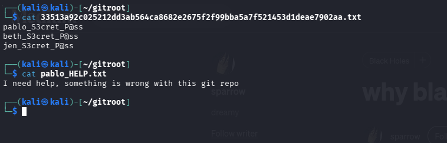

**found  passwords in file**
- found  3 passwords  & a hint  which say something is wrong in .git

hehe found password  


wait  WTF none of these password work anywhere nor this hint is usefull


### Git commit history & changes

```bash
git log -p
```

- shows your commit history along with the **full patch difference**

hehe got 1 more password


- also useless 🫃
---
# ssh bruteforce

- 😭 sometime we forgot basics  😭 : (weak creds combinations) 
- pablo:pablo

```bash
hydra -l pablo -P /usr/share/wordlists/rockyou.txt gitroot.vuln ssh
```

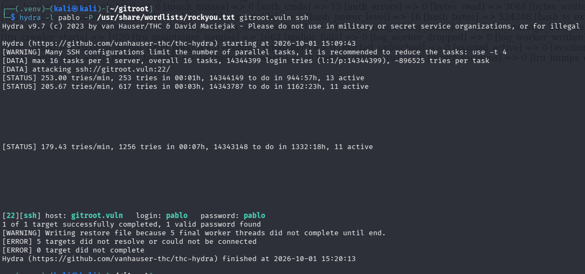

- creds : `pablo:pablo`
---
# initial shell
## shell (pablo)

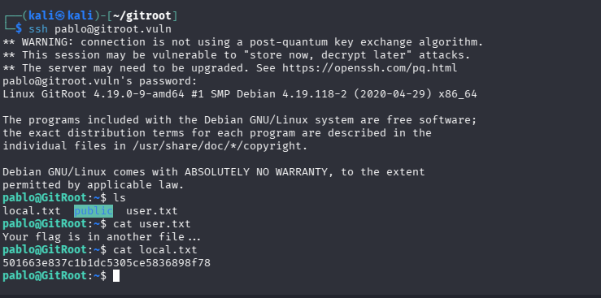


- found db password , but nothing useful in db, nor this password worked anywhere else

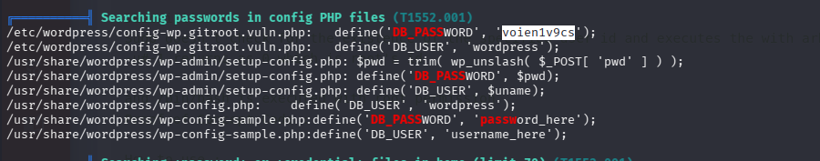

there is a `message.txt` : which say there is another git repo in system


use `find` to get the new git repo

```bash
find / -type d -name .git

/opt/auth/.git
```

### git commit history

- there are lot of branches in this repo (arount 190)
- now lets analyze the all branches, commits, text & files changes

```bash
git log --all --graph --oneline --decorate -p
```

- yeeeeeee got 1 more password

```bash
   
pablo@GitRoot:/opt/auth$ git log --all --graph --oneline --decorate -p
+//42
| * aaa283c (dev-43) init repo
| | diff --git a/main.c b/main.c
| | index 8af9b9c..30dca76 100644
| | --- a/main.c
| | +++ b/main.c
| | @@ -6,7 +6,7 @@ int main(){
| |          char pass[20];
| |          scanf("%20s", pass);
| |          printf("You put %s\n", pass);
| | -        if (strcmp(pass, "r3vpdmspqdb") == 0 ){
| | +        if (strcmp(pass, "PASSWORD") == 0 ){
| |                  char *cmd[] = { "bash", (char *)0 };
| |                  execve("/bin/bash", cmd, (char *) 0);
| |          }
| | @@ -16,3 +16,4 @@ int main(){
| |          return 0;
| |  }
| |  
| | +//43

```

- this time password worked 😃 for user beth
## shell (beth)

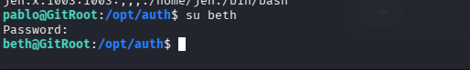

something interesting in : `addToMyrepo.txt`  🧠

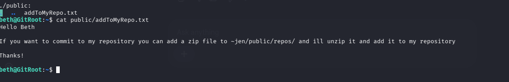

> [!addToMyRepo.txt]
> 
> user jen say if we put a zip in `/home/jen/public/repos` , he will add that to his repo
> 
> after using `pspsy64` i can see what happeing in background
> 
> user jen will extract our zip and commit it to there repo


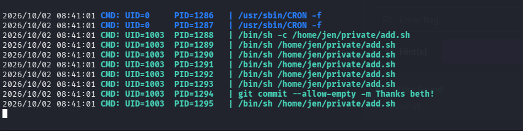


> [!possible attacks i used]
> 1. [git slip vulnerability](https://github.com/advisories/GHSA-25g8-2mcf-fcx9)
> 	- can use it to write files in target repo
> 	- and i succeeded to write files , then tried to overwrite add.sh
> 	- but i didn't worked , after solving lab i analyze `add.sh` it is implemented to always write to specfic directory
> 2. `Tar Wildcard Injection`
> 	- i assumed if jen use tar to extract zip, we can use wildcard injection to run script
> 	- but didn't worked (MC jen use 7zip)

- i used everything i know

**I used my BEST**


- At this point i took a Hint , and learned new thing

### git hooks

>![git hooks]
>	- 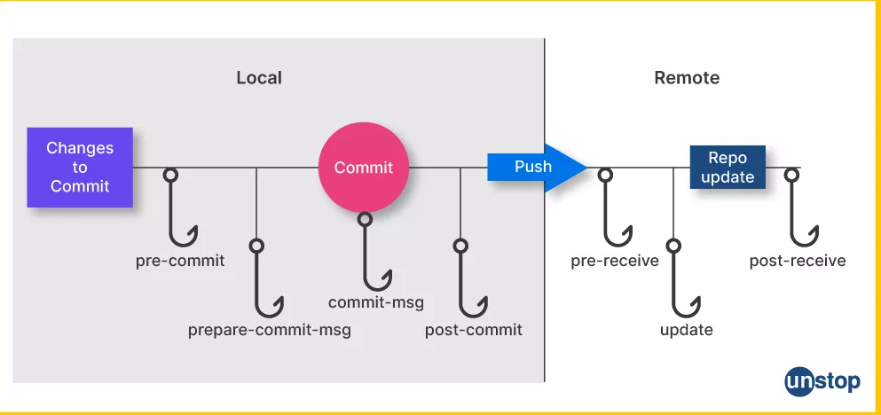
>	- **Git hooks are automated scripts that Git runs before or after specific lifecycle events** like committing, pushing, or merging
>	- git hooks location : `.git/hooks/`
>	- there are multiple scripts like : `pre-commit`, `post-commit` etc.
>	- we can make a `.git/hooks/post-commit` file with revshell exploit
>	- zip that `.git`, user will extract zip
>	- when jen try to commit , our script will execute


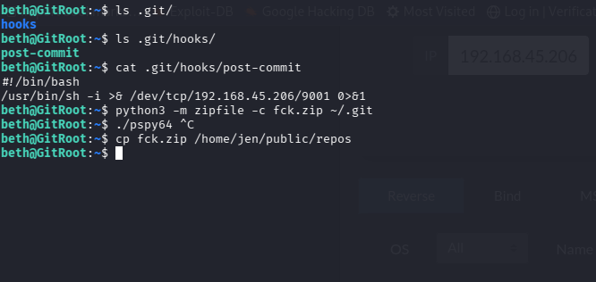


- got shell as jen

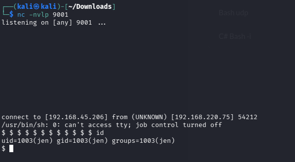

## shell (jen)

- after reading some files
- i found interesting stuff in `.viminfo`

### .viminfo

>![.viminfo]
>	- vim saves your Vim command history, search queries, marks & unsaved sessions in `.viminfo`

Jen is Noob don't know how to quit vim (just unplug the pc 😁 )

- well he searched some strings

```bash
jen@GitRoot:~$ cat .viminfo
cat .viminfo
# This viminfo file was generated by Vim 8.1.
# You may edit it if you're careful!

# Viminfo version
|1,4

# Value of 'encoding' when this file was written
*encoding=utf-8


# hlsearch on (H) or off (h):
~h
# Command Line History (newest to oldest):
:wq
|2,0,1590471909,,"wq"
:q!
|2,0,1590471893,,"q!"
:Q!
|2,0,1590471892,,"Q!"

# Search String History (newest to oldest):
?/binzpbeocnexoe
|2,1,1590471908,47,"binzpbeocnexoe"

# Expression History (newest to oldest):

# Input Line History (newest to oldest):

# Debug Line History (newest to oldest):

```
- and that string worked as his password (what a noob)

### sudo -l

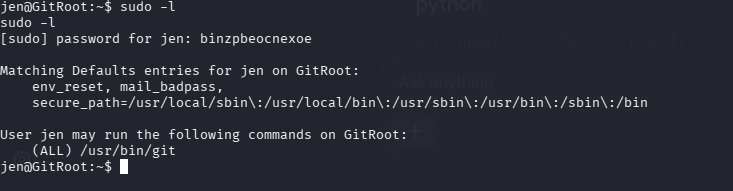

- we can use git as root without password
---
# root

- use gtfobin to get exploit

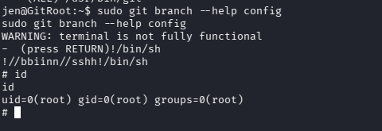


